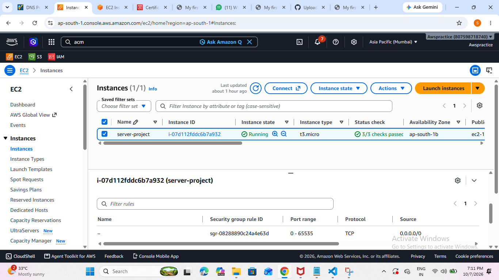
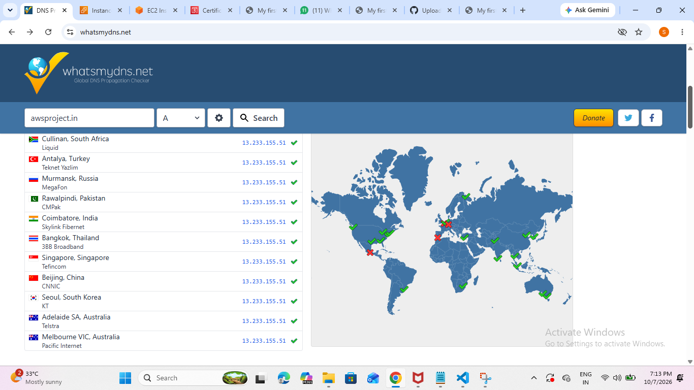

# AWS Project - awsproject.in

🌐 **Live Site:** https://awsproject.in  
🔒 **HTTPS:** Enabled with Let's Encrypt SSL  
✅ **Status:** Live in Production

### Stack Used (No DevOps Tools)
- **EC2** - Amazon Linux + Apache (Hosting)
- **IAM Role** - EC2 to S3 Secure Access
- **S3** - Storage
- **RDS** - MySQL Database
- **Route53 / Certbot** - Domain + SSL (ACM)

### Architecture
User -> awsproject.in -> EC2 (Apache) -> S3 + RDS
EC2 has IAM Role for S3 access (No hardcoded keys)
SSL via Certbot for HTTPS

### Live Proof

**1. EC2 Running**


**2. HTTPS Lock**


**3. DNS Live**


### How I Deployed
```bash
sudo yum install httpd -y
sudo systemctl start httpd
sudo yum install certbot python3-certbot-apache -y
sudo certbot --apache -d awsproject.in
